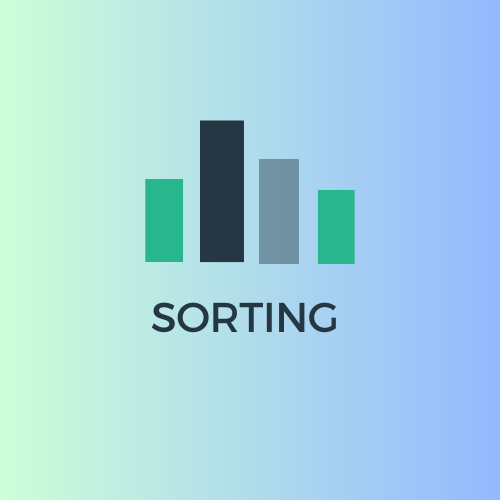

# Sorting Algorithms

Visualising various sorting algorithms using <b>Python</b> and <b>Tkinter</b>.
  
Algorithms include:
<ul>
<li>Selection Sort</li>
<li>Bubble Sort</li>
<li>Insertion Sort</li>
<li>Merge Sort</li>
<li>Quick Sort</li>
</ul>

Property:

- Animation speed can be scaled.
- The user can manually enter the list to be sorted.
- There are Create-Start-Stop-Regenerate Buttons.
- Sorting algorithms can be selected.
- Includes Scatter and Bar chart.

# Bar Graph

# Scatter Graph sorting phase

 

# Pause

